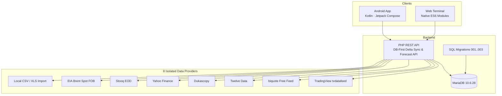

<!--
CHART Intelligence — project landing page
Detailed engineering and operational material: docs/04-development/PROJECT_GUIDE.md
-->

<p align="center">
  
</p>

<h1 align="center">CHART Intelligence</h1>

<p align="center">
  <strong>A modular financial chart analysis platform for web and Android.</strong><br>
  Multi-timeframe market data · Technical analysis foundation · Forecast evaluation roadmap
</p>

<p align="center">
  <a href="https://chart.manico.es"></a>
  <a href="https://github.com/manidigit/CHART/actions/workflows/build-apk.yml"></a>
  <a href="https://github.com/manidigit/CHART"></a>
  <a href="docs/01-product/CHART_INTELLIGENCE_MASTER_SPEC.md"></a>
</p>

<p align="center">
  <a href="#overview">Overview</a> ·
  <a href="#product">Product</a> ·
  <a href="#architecture">Architecture</a> ·
  <a href="#roadmap">Roadmap</a> ·
  <a href="#data-sources">Data sources</a> ·
  <a href="#documentation">Documentation</a>
</p>

---

## Overview

**CHART Intelligence** is an independent platform for viewing, analyzing, and evaluating probabilistic multi-timeframe financial market charts (`M15`, `M30`, `H1`, `H4`, `D1`, `W1`). The project combines a native Android application (Kotlin / Jetpack Compose) with a modular web terminal (`https://chart.manico.es`), unified through a PHP REST API and MariaDB central core.

The engineering direction prioritizes explicit market-series identity, UTC candle boundaries, holiday-aware data integrity, pure independently testable algorithms, and a strict out-of-sample forecast validation pipeline (`forecast-contract/v1` / spec `v1.3.0`).

> **Live Project Status (Verified `v1.47.41` — 2026-11-21 · Single Source of Truth for AI/Devs):**
> - **Active Production Runtime (`host_subdomain/` → `https://chart.manico.es`):** Phases 1–3 Core + the **Unified Browser-Native JavaScript Forecast Studio** (12 panels: `AUTO (OOS Best)`, `Causal Historical Analogs`, `Structural JS`, `SMC Prediction Engine` (`smc_prediction_js`), 10 native registry models, `Calibrated Ensemble`, `Quantile Fan / Hybrid / Quantile Bars`, `Coordinated MTF`, `Compare Overlays`, `Historical Replay`, and local SHA-256 `Ledger`) are **LIVE and enabled** on Web. The old Legacy Forecast Studio UI was **permanently removed** in `v1.47.38`.
> - **Owner-Validated Top Browser Models:** `Causal Historical Analogs`, `Structural JS`, and `SMC Prediction Engine` are the primary browser-native trajectories currently under active consistency & OOS evaluation (`FORECAST_CONSISTENCY_AND_ANALOG_ANALYSIS_V1.md`, `FCST-MODEL-QA-01`).
> - **Shelved / Inactive (`Python` & `Chronos-2`):** Shared cPanel hosting blocks `PHP exec()` and Python/PyTorch execution. Files such as `host_subdomain/api/v1/chronos2_forecast.php`, `host_subdomain/scripts/chronos2_worker.py`, and `.github/workflows/chronos2-manual-forecast.yml` are **NOT executed by the live Web UI** and are preserved (`Shelved`) until a dedicated Python server is provisioned.
> - **Android Client (`app/`):** Ships Phases 1–3 core (`79` symbols, `15/15` indicators, `18` drawing tools, `GapDetector`, historical import, encrypted backup); Android Forecast UI remains disabled pending cross-platform parity after Web/Python stabilization.
> - See [`AGENTS.md`](docs/04-development/AGENTS.md), [`OPEN_ISSUES.md`](docs/03-roadmap-and-issues/OPEN_ISSUES.md), and [`CHANGELOG.md`](docs/04-development/CHANGELOG.md).

## Product

### Shipped foundation (Web `v1.47.41` & Android Core)

- **Cross-Platform Parity (TradingView Pro Standard):** Responsive desktop/mobile web workspace (`host_subdomain`) and native Android Jetpack Compose app sharing the TradingView palettes (`#131722` dark / `#FFFFFF` light), circular vector asset badges for all 79 symbols, and `JetBrains Mono` LTR tabular digits.
- **Unified Top-Bar Workspace (Zero Right-Rail Clutter):** Primary workspace sections—**`Chart`**, **`Forecast` (LIVE unified browser-native studio on Web; disabled on Android)**, **`Performance`**, **`Watchlist`**, and **`Settings`**—live in the top header bar alongside the **Indicators** button, **`CSV`** export button, **Snapshot** camera button, and a minimal **blinking green/red Market Status dot** (`Live` / `Market Closed`).
- **79-Symbol Catalog, Non-Blocking Timeframe Switching & Storage Quota Safety:** 22 default watchlist symbols + 57 global equities available in Settings (`tvdatafeed` active only), with per-symbol `AbortController` request cancellation, unified `?v=1.47.41` ES-module graph + `globalThis.__CI_STORE_SINGLETON_V1__` guard (`ARCH-02`), and quota-safe `safeLocalStorageSet()` with automatic candle-cache eviction (`STORAGE-QUOTA-01`) preserving up to 5,000 candles in RAM & MariaDB.
- **Multi-Tab Chart & Complete Phase 2 Studies (`15/15` Indicators + `18` Drawing Tools):**
  - Parallel chart tabs (`${SYMBOL}_${TF}`), 6 timeframes (`15m`, `30m`, `1h`, `4h`, `1D`, `1W`), Heckbert nice-number price scaling (`[Auto] [Log]`), `UTC / Local` time axis, and 11 quick date ranges (`1D..All`).
  - **6 Base + 12 Multi-Anchor Drawing Families:** `HLINE`, `VLINE`, `TREND`, `FIB`, `LONG_POS`, `SHORT_POS`, `AVWAP`, `FRVP`, `Linear Regression Channel`, `Gann Fan`, `Gann Box`, 4-variant `Pitchfork` (`Original / Schiff / Mod Schiff / Inside`), `Fib Time Zone`, `Cyclic Lines`, `Fib Speed Resistance Fan`, `ABCD`, `XABCD`, and `Head & Shoulders` with `Magnet Mode`.
  - **All 15 Core Indicators & SMC Overlays:** `EMA 20/50/200`, `SMA 20/50/200`, `MTF EMA 20`, `Bollinger Bands`, `Supertrend`, `Session VWAP`, `Parabolic SAR`, `Ichimoku Cloud`, `Keltner Channels`, `Donchian Channels`, 4-variant `Pivot Points` (`Standard / Fibonacci / Camarilla / Woodie` with `R1..R4 / S1..S4`), `Killzones`, `BOS/CHoCH`, `EQH/EQL`, `FVG`, `Estimated Session VRVP`, and lower panes (`Volume`, `RSI 14`, `MACD`, `Stochastic`, `ATR 14`, `ADX 14`, `CCI 20`, `Williams %R`, `OBV`, `CMF 20`, `ROC 12`).
- **Phase 3 Data Quality, Holiday-Aware Gap Detection & Encrypted Backup:**
  - Session- and holiday-aware `GapDetector` (`GapDetector.php`, `gapDetector.js`, `GapDetectorAlgorithm.kt`) separating real feed outages from weekends, daily futures settlement breaks (`21:00–23:59 UTC`), early US holiday closes, and single-day exchange holidays.
  - Historical data import (`CSV/TSV`, binary `BIFF8 OLE2` `EIA RBRTEd.xls`, `JSON`, manual `OHLC` with strict `ERR_IMAGE_UPLOAD_FORBIDDEN`) and `PBKDF2 + AES-256-GCM` encrypted workspace backup/restore.
- **Phase 4 Unified Browser-Native Forecast Studio (Web `v1.47.35–v1.47.41`):**
  - Runs 100% in-browser on closed TradingView candles (`is_closed !== false`) strictly on explicit user click—requiring zero Python/PyTorch or PHP `exec()` on shared hosting.
  - Includes **`Causal Historical Analogs`**, **`Structural JS`** (`structural_wave_js` via Web Worker), **`SMC Prediction Engine`** (`smc_prediction_js`), **10 native JS registry models**, **`AUTO (OOS Best)`**, **`Calibrated Ensemble`**, 3 zero-synthetic-OHLC chart render modes (`Quantile Fan`, `Hybrid`, `Quantile Bars`), `Coordinated MTF`, multi-model `Compare Overlays`, `Historical Replay`, and local SHA-256 `ForecastLedger`.
  - Legacy Forecast Studio UI was permanently removed in `v1.47.38`; Python Worker & `Chronos-2` remain shelved/inactive until a dedicated Python server is provisioned.
- **Bilingual (`fa` / `en`) & BYOK:** Persian (RTL default) and English (LTR), salted SHA-256 owner login with `Remember Me` and 6-digit email OTP recovery, DB-First Delta Sync up to 5,000 candles, and isolated personal API keys (`BYOK` via `X-Provider-Api-Key`).

## Roadmap

The roadmap follows a strict **Build → Install → Practical Test → Owner Approval** gate between phases:

| Phase | Focus | Current State | Details |
|---:|---|---|---|
| 1 | Product foundation, multi-tab charts, 79-symbol catalog & Web state/storage stability | **Shipped & Hardened (`v1.35–v1.47.41`)** | [ROADMAP_BACKLOG.md](docs/03-roadmap-and-issues/ROADMAP_BACKLOG.md) |
| 2 | All 15 core indicators (incl. 4-variant Pivots), 18 drawing tools (`Harmonic/Gann/Pitchfork/Cycle/AVWAP/FRVP`), `Symbol Intel` & `Seasonals` | **Shipped in code (`v1.39–v1.41`)** | [ROADMAP_BACKLOG.md](docs/03-roadmap-and-issues/ROADMAP_BACKLOG.md) |
| 3 | Holiday-aware Smart Gap detection, EIA/CSV/BIFF8 imports, `CSV` export & `AES-256-GCM` Backup/Restore | **Shipped in code (`v1.41–v1.44`)** | [ROADMAP_BACKLOG.md](docs/03-roadmap-and-issues/ROADMAP_BACKLOG.md) |
| 4 | Unified Forecast Studio (Browser-Native JS live on Web; Python/Chronos-2 deferred to dedicated server) | **Web Browser-Native Live (`v1.47.41`) · Python/Chronos-2 Shelved · Consistency & OOS Acceptance Open** | [FORECAST_PRODUCT_FOUNDATION_V1.md](docs/01-product/FORECAST_PRODUCT_FOUNDATION_V1.md) |
| 5 | Live Feedback Loop, `Purged + Embargoed Walk-Forward` governance & `Champion/Challenger` promotion gate | **Planned** | [CHART_INTELLIGENCE_MASTER_SPEC.md](docs/01-product/CHART_INTELLIGENCE_MASTER_SPEC.md) |
| 6 | Offline Strategy Simulator & Multi-user admin | **Planned** | [TRADING_STRATEGY_SPEC.md](docs/01-product/TRADING_STRATEGY_SPEC.md) |

## Architecture

The repository separates the Android client, Web ES6 modules, PHP REST API, 8 data-provider adapters, and MariaDB migrations:


```mermaid
flowchart TB
    subgraph Clients
      A[Android App<br/>Kotlin · Jetpack Compose]
      W[Web Terminal<br/>Native ES6 Modules]
    end

    subgraph Backend
      API[PHP REST API<br/>DB-First Delta Sync & Forecast API]
      DB[(MariaDB 10.6.28)]
      MIG[SQL Migrations 001..003]
    end

    subgraph MarketData[8 Isolated Data Providers]
      TV[TradingView tvdatafeed]
      BQ[biquote Free Feed]
      TD[Twelve Data]
      DK[Dukascopy]
      YF[Yahoo Finance]
      SQ[Stooq EOD]
      EIA[EIA Brent Spot FOB]
      CSV[Local CSV / XLS Import]
    end

    A --> API
    W --> API
    API --> DB
    MIG --> DB
    API --> TV
    API --> BQ
    API --> TD
    API --> DK
    API --> YF
    API --> SQ
    API --> EIA
    API --> CSV
```

## Data sources

CHART keeps market-series identity explicit (`UNIQUE(chart_id, provider_id, timeframe, open_time_utc)`). Spot, CFD, EOD, and Futures series are strictly isolated and configured per symbol in **Settings**:

| Provider ID | Scope & Role | Default Symbols / Series |
|---|---|---|
| `tvdatafeed` | TradingView sockets & curated seeded archives (`M15..W1`) | `SPOTBRENT`, `USOIL`, `EURUSD` (primary) |
| `twelve_data` | REST API (server secret or `BYOK`) | `XAUUSD` (primary) |
| `biquote` | Keyless multi-asset intraday/daily feed | `XAGUSD`, `BTCUSD`, `ETHUSD` (primary) |
| `yahoo_finance` | US equities, global indices & futures | `SPX500USD`, `NDQ`, `NVDA..SAN` (primary); `BZ=F`, `GC=F` |
| `dukascopy` | Swiss interbank historical feed (`volume=0` weekend filter) | `SPOTBRENT`, `XAUUSD`, `XAGUSD`, `EURUSD` |
| `stooq` | Free multi-year EOD (`D1`/`W1`) CSV feed | Long-term daily/weekly validation & equities |
| `eia_brent_spot` | Official U.S. EIA daily benchmark (`RBRTEd`, 1987–present) | `SPOTBRENT` historical `D1` FOB benchmark |
| `local_csv` | Audited historical file import (`CSV`, `EIA BIFF8 XLS`, `JSON`, manual `OHLC`) | Custom / archival series (`data_import_batches`) |

## Repository layout

All markdown documentation (except this `README.md`) is organized under `docs/`:

```text
.
├── app/                                      # Native Android app (Kotlin, Compose, GapDetector, REST + local cache)
├── host_subdomain/                           # LIVE WEB PRODUCTION ROOT (https://chart.manico.es · v1.47.41)
│   ├── api/v1/                               # PHP REST API (auth, candles_sync, workspace_sync, gap_report, provider adapters; chronos2_forecast.php SHELVED)
│   ├── scripts/                              # tvdatafeed sync scripts (chronos2_worker.py SHELVED / deferred to dedicated server)
│   ├── assets/js/                            # 27 Native ES6 modules (?v=1.47.41): core/, services/, components/, views/, algorithms/, forecast/, workers/
│   ├── data/tvdatafeed/                      # Seeded SPOTBRENT candles (M15, H1, H4, D1)
│   ├── i18n/                                 # Web dictionaries (fa.json, en.json)
│   └── migrations/                           # Idempotent MariaDB migrations (001_phase1..005_catalog)
├── docs/
│   ├── README.md                             # Documentation Hub & Live State Snapshot
│   ├── assets/chart-hero.svg                 # Repository hero banner
│   ├── 01-product/
│   │   ├── CHART_INTELLIGENCE_MASTER_SPEC.md # Primary source of truth (product, contracts, formulas, phases)
│   │   ├── FORECAST_PRODUCT_FOUNDATION_V1.md # Independent Forecast Product Foundation
│   │   ├── FORECAST_SYSTEM_SPEC_V1.md        # Model-independent Forecast system specification
│   │   ├── FORECAST_MODEL_INTAKE_AND_COMPARISON_V1.md # Evidence-based model intake & screening protocol
│   │   ├── FORECAST_CHRONOS2_INPUT_OUTPUT_AND_PATH_CONTRACT_V1.md # Chronos-2 contract (Shelved)
│   │   ├── GROK_OPENMARKET_RESEARCH_NOTES.md # Provider & ML architecture research notes
│   │   └── TRADING_STRATEGY_SPEC.md          # Phase 6 offline strategy simulation spec
│   ├── 02-architecture/
│   │   ├── ARCHITECTURE.md                   # Central Core, DB-First Delta Sync, providers & 79-symbol catalog
│   │   ├── TECHNICAL_ANALYSIS_CORE_IMPLEMENTATION_PLAN_V1.md # Deterministic analysis core plan
│   │   ├── DESIGN_WORKSPACE_SPEC.md          # TradingView Pro workspace layout, topbar navigation & tokens
│   │   ├── FORECAST_CONSISTENCY_AND_ANALOG_ANALYSIS_V1.md # Draft MTF & horizon consistency analysis
│   │   ├── FORECAST_ACCEPTANCE_TEST_PLAN_V1.md # Model-independent Forecast acceptance test scenarios
│   │   ├── FORECASTING_ALGORITHM_REFERENCE.md # Curated ML/statistical algorithm review
│   │   ├── CHRONOS2_MANUAL_GITHUB_ACTIONS_RUNBOOK_V1.md # Manual Chronos-2 runner (Shelved)
│   │   ├── INFRASTRUCTURE_INVENTORY.md       # Verified cPanel / MariaDB host inventory & limits
│   │   └── SECURITY.md                       # Security policy, zero-secrets & BYOK isolation
│   ├── 03-roadmap-and-issues/
│   │   ├── OPEN_ISSUES.md                    # Verified open bugs, Forecast blockers & closed audit items
│   │   └── ROADMAP_BACKLOG.md                # Truthful Shipped Core vs Phase 4–6 backlog
│   └── 04-development/
│       ├── PROJECT_GUIDE.md                  # Code-vs-Spec audit table, secrets registry & CI/CD guide
│       ├── AGENTS.md                         # AI & developer invariants, live map & UI directives
│       ├── CONTRIBUTING.md                   # Build, test & PR workflow
│       └── CHANGELOG.md                      # Chronological release history (up to v1.47.41)
├── tests/                                    # Node.js web parity & Forecast regression suite (59/59 passing)
├── .github/workflows/
│   ├── build-apk.yml                         # Android APK build + Web/DB cPanel deployment workflow
│   ├── forecast-validation.yml               # Forecast native parity & syntax validation
│   └── chronos2-manual-forecast.yml          # Manual Chronos-2 runner workflow (Shelved)
├── package.json                              # Root ES module & test script definitions
└── README.md                                 # Project landing page
```

## Verification Tests

Run the local verification suites:

```bash
# 1. Web parity & timeframe-switch abort safety tests
npm test

# 2. Android JVM & Robolectric unit tests
gradle :app:testDebugUnitTest
```

## Documentation

Start at [`docs/README.md`](docs/README.md) for the full reading order by role, or jump directly to:
- **Truthful Current Status & Active Work:** [`OPEN_ISSUES.md`](docs/03-roadmap-and-issues/OPEN_ISSUES.md) · [`ROADMAP_BACKLOG.md`](docs/03-roadmap-and-issues/ROADMAP_BACKLOG.md) · [`FORECAST_CONSISTENCY_AND_ANALOG_ANALYSIS_V1.md`](docs/02-architecture/FORECAST_CONSISTENCY_AND_ANALOG_ANALYSIS_V1.md)
- **Specs & Architecture:** [`CHART_INTELLIGENCE_MASTER_SPEC.md`](docs/01-product/CHART_INTELLIGENCE_MASTER_SPEC.md) · [`FORECAST_PRODUCT_FOUNDATION_V1.md`](docs/01-product/FORECAST_PRODUCT_FOUNDATION_V1.md) · [`ARCHITECTURE.md`](docs/02-architecture/ARCHITECTURE.md) · [`DESIGN_WORKSPACE_SPEC.md`](docs/02-architecture/DESIGN_WORKSPACE_SPEC.md)
- **Developer & Ops:** [`PROJECT_GUIDE.md`](docs/04-development/PROJECT_GUIDE.md) · [`CHANGELOG.md`](docs/04-development/CHANGELOG.md) · [`AGENTS.md`](docs/04-development/AGENTS.md) · [`INFRASTRUCTURE_INVENTORY.md`](docs/02-architecture/INFRASTRUCTURE_INVENTORY.md) · [`SECURITY.md`](docs/02-architecture/SECURITY.md)

## Project principles

- **Evidence over assumptions:** Verify the actual repository code before marking any spec item complete.
- **Modularity:** Keep screens, components, providers, and pure math algorithms cleanly separated.
- **Data integrity:** Preserve instrument identity (`chart_id`), UTC timestamps, and `DECIMAL(18,8)` price precision.
- **Security by design:** Never commit secrets or send personal API keys inside shared workspace sync payloads.

---

<p align="center">
  <strong>CHART Intelligence</strong><br>
  <sub>Analyze clearly. Validate continuously. Improve with evidence.</sub>
</p>
